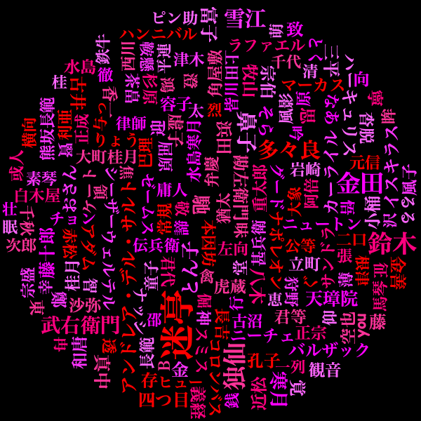

# JavaでWordCloudを試す

## 主に利用したもの
 - [Sudachi](https://github.com/WorksApplications/Sudachi)
 - [Kumo](https://github.com/kennycason/kumo)

## セットアップ
- [Sudachi](https://github.com/WorksApplications/Sudachi)のREADMEのDictionariesから`sudachi-dictionary-latest-full.zip`をダウンロードする
- 解凍したディレクトリの`system_full.dic`を`system_core.dic`にリネームする
- `system_core.dic`を`./`に配置する

## WordCloud画像の生成
- `./src/main/java/com/example/WordCloudBuilderKumo.java`を実行する
- `./output/wordcloud_rectangle.png`が生成される

### **実行例**
 ※[青空文庫](https://www.aozora.gr.jp/cards/000148/files/789_14547.html)「夏目漱石 吾輩は猫である」の全文を入力(./aozora_dummy_text.txt)として、その中に登場する人名に対してWordCloud画像を出力する
 
