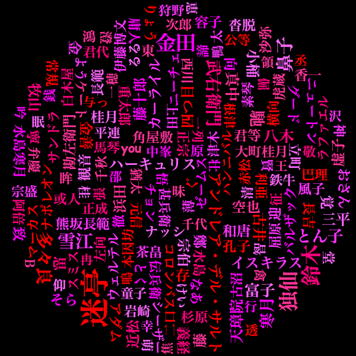

# JavaでWordCloudを試す

## 主に利用したもの
 - [Sudachi](https://github.com/WorksApplications/Sudachi)
 - [Kumo](https://github.com/kennycason/kumo)

## セットアップ
- [Sudachi](https://github.com/WorksApplications/Sudachi)のDictionariesから`sudachi-dictionary-latest-core.zip`をダウンロードする
- 回答したディレクトリの`system_core.dic`を`./`に配置する

## WordCloud画像の生成
- `./src/main/java/com/example/WordCloudBuilderKumo.java`を実行する
- `./output/wordcloud_rectangle.png`が生成される

### **実行例**
 ※青空文庫「夏目漱石 吾輩は猫である」から約5万文字程を入力(./aozora_dummy_text.txt)として、その中の固有名詞におけるWordCloud画像を出力する
 